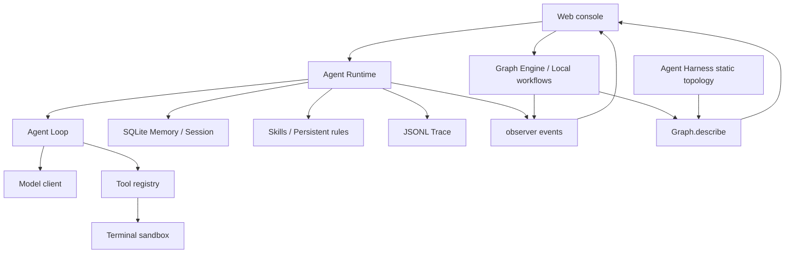

# Everything Agent

[简体中文](README.md) | English

A personal assistant Agent that runs locally: it completes tasks through models and controlled tools, maintains searchable personal memory, and shows memory retrieval, context assembly, model reasoning, and tool execution in a visual console.

**API keys are persisted locally only.** Sessions, memories, and execution records are stored locally by default. You choose the model services and configure their connections.


## Quick start

### 1. Prepare your environment and start

You need **Node.js 24.12 or later** and a model service supporting OpenAI Compatible, Anthropic Messages, or the native Google Gemini protocol.

For first-time use, choose the release package matching your operating system and CPU architecture, enter its release directory, and run `npm start`. Production dependencies are included; no dependency installation or rebuild is required. For example, on an Apple Silicon Mac:

```bash
cd release/everything-agent-darwin-arm64
npm start
```

Use the corresponding release directory on other platforms. Install Node.js separately.

If `npm start` cannot launch the release package (for example, because the platform does not match or a prebuilt native module is missing), use development mode: return to the **repository root**, run `pnpm install`, then `pnpm run dev`. Development mode runs the source directly, provides the same web console and local backend, and supports editing workflows on the Workflow page. See “Development and checks” below.

Personal data is stored in `.everything/` under the launch directory by default. Set `EVERYTHING_HOME` to choose another data root. See [Production builds, packaging, and delivery](docs/production.md) for platform limitations, data locations, and troubleshooting. Development and packaging commands are listed below.

Open the local URL printed in the terminal. This command starts both the web console and local backend. Keep the terminal running during use; press `Ctrl+C` to stop.

On first launch, configuration, the database, rule files, and the Skills directory are created automatically under `.everything/`. You do not need to create an `.env` file or deploy Docker or Langfuse first. The console opens even before models are configured.

### 2. Configure both model connections

Open **Settings** in the left sidebar. Configure and save **Agent Model** and **Small Model** separately:

| Connection | Purpose | First-time requirement |
| --- | --- | --- |
| Agent Model | Primary reasoning, tool calls, memory writes, and consolidation | Configure a model supporting tool calls |
| Small Model | Decide whether this turn needs memory retrieval and what to retrieve | Also requires a complete connection |

These connections are independent; neither automatically shares settings with or falls back to the other. You can initially enter the same service URL, model, and key for both, then adjust them separately as needed.

Each connection has these fields:

| Field | What to enter |
| --- | --- |
| Provider | Select `OpenAI Compatible`, `Anthropic`, or `Google Gemini` according to the service protocol |
| Model | The service's exact model ID, not a custom name |
| Base URL | The API base URL. OpenAI Compatible usually includes `/v1`; Anthropic uses the service root; Gemini defaults to `https://generativelanguage.googleapis.com/v1beta`. Do not append a generation method or endpoint path |
| API Key | The service key. After saving, only its configured status and last four characters are shown |

For proxies or self-hosted services, enter their actual API base URL. When saving a new key, Provider, or Base URL, the backend attempts to read the model list to test the connection. A failed test does not overwrite existing settings by default. Some compatible services have no model-list endpoint; verify the settings, choose “Save anyway,” and confirm the connection through an actual conversation.

For **Google Gemini**, select that Provider and enter the Gemini model ID and API key. Leave Base URL blank to use Google's official URL, or enter a native-protocol proxy URL including the API version. The current integration uses API-key authentication for the Gemini Developer API and supports text, streaming responses, and tool calls. It does not include Vertex AI authentication, images, audio, or video. Embeddings independently support OpenAI Compatible and Google Gemini. See [Model integration](src/model/README.md).

Check **Context Window** and **Maximum model output** against the selected model's limits. Their defaults are 262,144 and 32,768 tokens respectively; not every model supports these values. Input, reserved output, and the safety margin must fit within the context limit together.

### 3. Send your first message

Return to **Agent** and send “Hello, please tell me what you can do.” A streaming reply on the right and execution activity on the central canvas confirm that basic chat works.

Then try “Please remember that I prefer concise answers,” and open **Memory** to inspect the background write. Memory writes are asynchronous and may still be running when the reply ends. Use **Traces** to inspect execution.

Keep the default keyword retrieval for your first session. **Embedding, web search, and terminal tools do not need to be configured.**

## API keys and local data

**Model, Embedding, and Tavily API keys saved through Settings are persisted only in the local `.everything/.env` file.** Ordinary settings and secrets are stored separately. Configuration APIs return only whether a key is configured and its last four characters, never the full key. The entire `.everything/` directory is ignored by Git.

“Stored locally” describes the storage location. The local backend still uses keys to authenticate requests to your configured service URLs, so use a Base URL you trust. The key file is not encrypted; programs with local file-read access may read it.

| Default path | Contents |
| --- | --- |
| `.everything/.env` | Model, Embedding, and Tavily keys |
| `.everything/config.json` | Model connections, retrieval settings, runtime budgets, and tool switches |
| `.everything/database/state.db` | Sessions, chat history, long-term memories, and background tasks |
| `.everything/EVERYTHING.md` | Editable persistent assistant rules |
| `.everything/skills/` | Local Skill files |
| `.everything/traces/` | JSONL execution records |
| `.everything/sandbox/` | Default terminal tool workspace |

Additional data boundaries:

- **Model calls send the necessary context**, including the conversation, recalled memories, rules, and required tool information. Enabling vector retrieval or web search also sends relevant content to those services.
- **Local Traces may contain private content.** Common credentials are redacted, but model inputs, replies, and tool results may remain. Inspect logs before sharing them.
- **Routine remote Trace export is off by default.** After manually enabling Langfuse, only metadata is exported by default. Content capture and evaluation uploads have separate boundaries; see [Tracing](src/tracing/README.md) and [Evaluation](src/evaluation/README.md).
- **Clearing data does not clear keys.** “Clear all data” preserves model settings, keys, persistent rules, Skills, and Langfuse connection settings. It does not delete records already uploaded remotely.

For backups, stop the service before copying `.everything/`. Treat the backup as a private file containing credentials and personal information.

## Optional settings

| Need | Where to configure it |
| --- | --- |
| Adjust persistent assistant rules | Edit Procedural Memory in Settings, or use `manage_everything` to read and update `.everything/EVERYTHING.md` |
| Use Skills | Create or edit skills on **Skills**. Each turn injects only names and descriptions; full instructions load on demand. See [Skills](src/skills/README.md) |
| Enable semantic vector retrieval | Select Dense or Hybrid under Memory Retrieval, choose an independent Embedding Provider (OpenAI Compatible / Google Gemini), enter its connection settings, and rebuild the index. Requests use fixed 1024-dimensional vectors. Historical session retrieval always uses FTS5. See [Memory](src/memory/README.md) |
| Search the web | Configure a Tavily API key under **Tools** and enable `search_web` |
| Run terminal commands | Confirm the workspace under **Settings → Sandbox**, then enable `run_terminal` under **Tools**. It is off by default. See [Sandbox](src/sandbox/README.md) |
| Explore sample data | Run `pnpm run mock-data` to generate and merge data through a local mock model, without network requests or model usage. See [Mock data](mock-data/README.md) |
| Add tracing and evaluation | Follow [Langfuse deployment](deploy/langfuse/README.md) and [Evaluation usage](src/evaluation/README.md). Regular conversations do not require these services |

The terminal tool uses Seatbelt on macOS and bubblewrap on Linux / WSL2. If a sandbox cannot be established, it does not fall back to unprotected execution. Native Windows does not provide this capability. Outbound networking is disabled by default; commands can write only to the designated workspace and session temporary directory. Files inside the workspace may still be modified or deleted, so review approval requests carefully.

## Feature overview

| Page | Currently implemented capabilities |
| --- | --- |
| Agent | Multi-turn sessions, streaming replies, stop generation, and live memory retrieval, model reasoning, and tool execution |
| Memory | View and manage long-term memory, retrieve past sessions, inspect Chat Log and consolidation results |
| Skills | Create, edit, rename, and delete local skills for on-demand Agent use |
| Tools | Browse the actual tool catalog and configure optional tools and enabled status |
| Traces | Inspect persisted local execution records, timings, and model, tool, and memory-task errors |
| Workflow | Edit and run local TypeScript Graph workflows with actual topology and execution events |
| Database | Browse SQLite tables and data, and run restricted SQL; writes require page confirmation |
| Evaluation | Run dataset evaluations with real models and tools; inspect execution, sync, and scoring status |
| Settings | Manage model connections, runtime budgets, retrieval, persistent rules, the sandbox, and local data |

Long-term memory writes run serially in the background and support creation, updates, deletion, and merging. Daily and manually triggered Consolidation organizes existing facts. See [Memory](src/memory/README.md) and [Consolidation](src/memory/CONSOLIDATION.md).

## Architecture

The Agent chat panel updates elapsed time only for a running reply. Completed turns use their recorded duration; stopped or failed turns freeze the timer. Reloaded historical turns use the time difference between the user message and final reply. Incomplete turns or invalid timestamps show “Duration unknown.”

The web console root URL is replaced with `#/agent` without adding browser history. URL hashes such as `#/memory` record the current page, preserve it across reloads, and support browser back, forward, and direct page links. Navigation preserves the page location; it does not persist unsaved temporary state inside pages.

The console supports Simplified Chinese and English. On first visit it follows the browser's preferred language, using English for non-Chinese languages. The language button at the top right of **Agent** switches immediately and remembers the choice in browser storage. Switching does not reload the page or interrupt execution. Only interface text and predefined presentation labels are translated. Chat content, memories, raw logs, prompts, tool schemas, and Skill files remain unchanged, as does the Agent's reply language.

The web console connects to a local Node.js backend. Agent Runtime composes models, tools, and memory for the personal assistant; Graph workflows run through a separate entry point. This diagram shows the implemented module relationships:



- **Engine:** zero runtime dependencies. Manages State, Node, Graph, routing, concurrency, errors, and loop protection, without directly initializing models, databases, or UI.
- **Agent Loop:** executes `observe → reason → act → repeat`, with iteration limits, timeouts, cancellation, and tool-call events.
- **Agent Runtime:** manages local settings, session context, memory retrieval, background tasks, and model/tool integration.
- **Visualization:** static topology comes from `Graph.describe()`, and execution activity from observer events. The UI does not infer execution paths from final results.

Main directories and detailed documentation:

| Directory | Responsibility / Documentation |
| --- | --- |
| `web/` | React console and Vite local-backend bridge |
| `src/engine/` | [Graph public API, execution semantics, and examples](src/engine/README.md) |
| `src/agent-loop/` | [Agent turn interfaces and events](src/agent-loop/README.md) |
| `src/agent-runtime/` | [Integration interfaces, configuration, and resource lifecycle](src/agent-runtime/README.md) |
| `src/agent-graph/` | [Agent Harness topology and visualization boundaries](src/agent-graph/README.md) |
| `src/model/`, `src/tools/` | [Model protocols](src/model/README.md) and [independent tools](src/tools/README.md): registration, assembly, validation, execution, and safe event projection |
| `src/memory/` | [Sessions, SQLite, retrieval, and long-term memory](src/memory/README.md) |
| `src/skills/`, `src/sandbox/` | [On-demand skills](src/skills/README.md) and [terminal execution boundaries](src/sandbox/README.md) |
| `src/tracing/`, `src/evaluation/` | [Execution records](src/tracing/README.md) and [real-environment evaluation](src/evaluation/README.md) |
| `src/workflows/` | Editable, executable local workflows |
| `deploy/langfuse/`, `mock-data/` | Optional service deployment and mock-data utilities |

Frontend APIs are organized by domain under `web/src/apis/`. `agent-api.ts` handles bootstrap, chat, approvals, background events, and context usage. Settings, memory, skills, tools, traces, database, and data cleanup each have a corresponding `*-api.ts`; workflows and evaluation also have separate modules. Request functions and their types live together, and pages import them directly rather than through a forwarding module. `request-json.ts` handles JSON requests and error responses, including the `canForce` flag for forced configuration saves; streaming APIs reuse its error parser. `pages/agent/` and `pages/workflow/` contain their pages and dedicated logic. Components live under `components/`, and shared utilities and visual node state under `lib/`.

## Frequently asked questions

**Node.js, SQLite, or native module errors at startup?**

Run `node --version` to confirm version 24.12 or later, then `pnpm install`. The project uses Node.js built-in SQLite and the @node-rs/jieba native tokenizer, with prebuilt platform binaries and no required local compilation. If @node-rs/jieba installation fails, inspect the installation logs for a prebuilt package matching your platform.

**The page opens, but messages cannot be sent?**

Check that both Agent Model and Small Model have a Model, API key, and correct Provider / Base URL. Configuring only the primary model is insufficient for a complete turn. 401 / 403 usually indicate key or permission issues; for 404, check the base URL, protocol, and model ID.

**Connection test fails despite a seemingly correct service URL?**

The save-time test reads the model list; it cannot guarantee support for actual inference or tool calls. Conversely, some compatible services support inference without a model-list endpoint. Verify the service's capabilities before choosing “Save anyway,” then confirm with an actual conversation.

**The model reports an output budget or context limit error?**

Adjust Context Window and maximum model output to the service's actual limits. Long conversations compact automatically at 70% of the available input budget. The primary model summarizes old history with a soft target of about 30% total input after compaction. The current request and recent complete interactions take priority; original records remain inspectable, and checkpoints persist in Session. Oversized fixed input still produces an explicit error. Raising maximum Agent iterations does not enlarge context. Defaults are 100 iterations and a 300-second Agent turn timeout; you can also stop from the UI.

**Can only static files be deployed after building?**

No. `npm run build:web` creates browser assets only; Engine / Agent APIs still require a backend. Run `npm run build`, then `npm start` to serve both static pages and backend APIs in production.

## Development and checks

Development uses pnpm with `pnpm-lock.yaml` as the only repository lockfile. Update it when changing dependencies. Release packages start with the npm bundled with Node.js and do not require pnpm. The project uses ESM and strict TypeScript. Development runs backend TypeScript source. Production builds compile the backend and workflows to `dist-server/` for Node.js and build the frontend to `dist-web/` with Vite.

After cloning, install dependencies and start development from the repository root:

```bash
pnpm install
pnpm run dev
```

In development, Workflow can directly edit `src/workflows/*.ts`. “Reload” uses the same loading feedback as “Refresh data,” then displays success or failure. Production runs build artifacts; source changes require rebuilding, packaging, and restarting.

Frontend translation uses Lingui. Mark Chinese source text with `Trans` / `t`, and use `msg` for notifications that must stay translatable across language switches. After adding messages, run `pnpm run i18n:extract`, complete `web/src/locales/en/messages.po`, and run `pnpm run i18n:check` to validate completeness and ICU syntax. Vite compiles PO catalogs automatically; generated `messages.js` files are not committed.

Checks and packaging commands:

```bash
pnpm run typecheck       # Backend type checks
pnpm test               # Vitest behavior tests
pnpm run test:coverage  # Coverage checks
pnpm run build          # Backend/workflow compilation + frontend checks/build
pnpm run example        # Minimal Graph example; no model key needed
pnpm run package        # Install locked production dependencies and package existing builds into release/
pnpm run verify:package # Verify release packages start independently
```

Tests exercise observable behavior through public interfaces and live in each module's `test/` directory. Vitest enforces 90% statement, function, and line coverage and 85% branch coverage; test helpers are excluded from product coverage. See [AGENTS.md](AGENTS.md) for development constraints.

For failed or slow tests, run `pnpm exec vitest run --reporter=default --reporter=json --outputFile.json=/tmp/everything-tests.json` and inspect assertion status and timings in the JSON report. HTTP integration tests need permission to bind local ports; insufficient permission must fail explicitly rather than skipping assertions. Frontend tests prioritize interactions, accessibility state, and feedback semantics, without locking full class strings, CSS values, or SVG coordinates. Mock-data trace tests use minimal fixed-seed scenarios. Process recovery, native-module loading, and sandbox timeout tests retain real execution boundaries.

## Current boundaries and roadmap

The local personal-assistant loop is implemented: model and tool calls, multi-turn sessions, long-term memory, Skills, execution visualization, Traces, and optional real evaluations. The project is still in requirements development; interfaces and data structures may change directly, without backward-compatibility guarantees.

Current boundaries:

- Designed for one user locally. No built-in authentication, multi-tenancy, cloud sync, or local data encryption. Do not expose the console directly to the public internet.
- Runs continue when navigating inside the console, but active foreground runs cannot be restored after a browser reload or close.
- Agent and Memory have persisted JSONL records. Workflow currently uses live observers and does not write to the same Trace system.
- The sandbox limits execution scope; human approval handles some external and destructive effects. Command-text matching is not a complete security guarantee.

Planned work:

- Improve state-difference displays and execution inspection.
- Add personal-assistant integrations for calendars, tasks, and notes.
- Expand permissions, external-write confirmation, and auditing as tools grow.

These directions are not all implemented. Current code and module documentation determine available capabilities.

### Session and execution identifiers

`sessionId` identifies a session; `turnId` identifies a complete turn from user submission through reply, failure, or cancellation. Within a turn, `iteration` distinguishes reasoning iterations. Background tasks use `taskId` and link to the originating turn through `sourceTurnId`. Traces group records with `traceId`; chat lifecycle events are `turn_started`, `turn_completed`, and `turn_failed`. Engine `runGraph()` and evaluation experiment Runs retain their own execution semantics. See [Domain terminology](CONTEXT.md) and the [Tracing event protocol](src/tracing/README.md).
